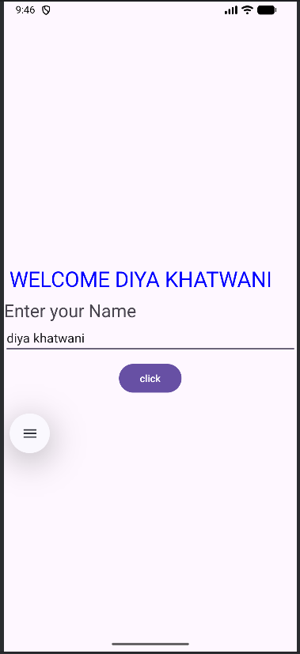
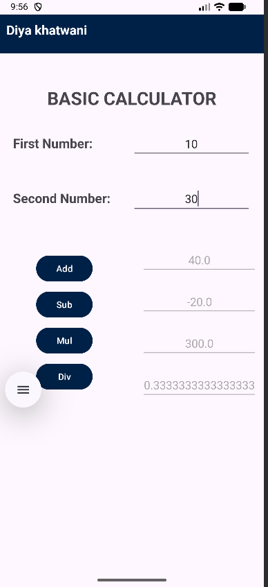
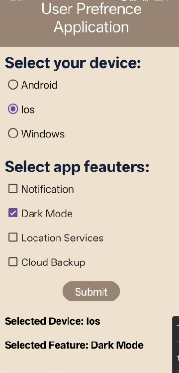
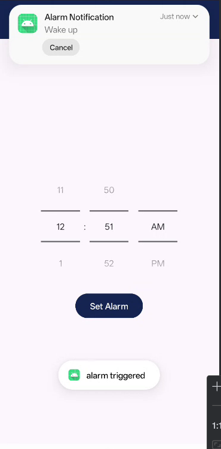
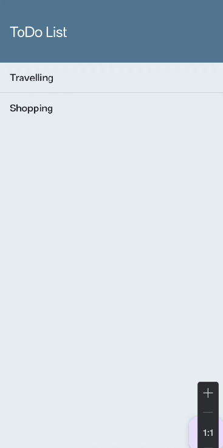
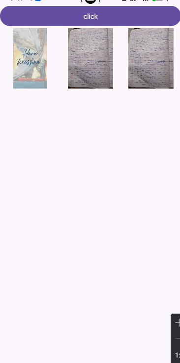
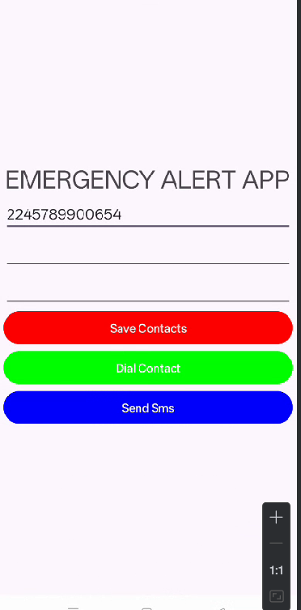
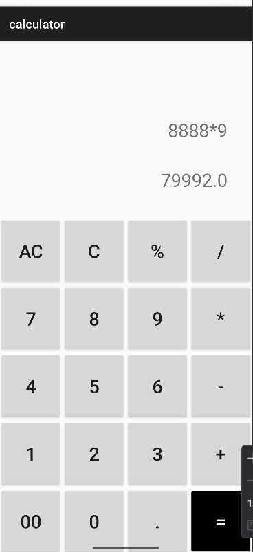

This projects contains a collection of Android applications developed using **Java** and **Android Studio**. These applications demonstrate different Android development concepts such as layouts, event handling, RecyclerView, fragments, notifications, SQLite database integration, navigation systems, and UI designing.

# 1. Student Details App

The Student Details App is a simple Android application developed using Java and XML. This application collects student information using input fields and displays the entered details using Toast messages.

## Features
- Student name input
- Email and phone number input
- User-friendly interface
- Toast message display
- Button click handling
- Input validation

## Technologies Used
- Java
- XML Layouts
- Android Studio
- Toast Messages
- EditText and Button Components

## Screenshot

---

# 2. User Input Application

This Android application demonstrates user input handling and interactive form design using Java and XML layouts.

## Features
- User input handling
- Interactive form design
- Button click events
- User interaction handling
- Simple navigation system

## Technologies Used
- Java
- XML
- Android SDK
- Android UI Components
- Event Handling

## Screenshot

---

# 3. Calculator App

The Calculator App is a simple Android application developed using Java and XML that performs basic arithmetic operations with a clean and responsive interface.

## Features
- Addition
- Subtraction
- Multiplication
- Division
- Interactive calculator UI
- Responsive layout design

## Technologies Used
- Java
- XML Layout Design
- Android Studio
- Button Event Handling
- TextView and EditText Components

## Screenshot

---

# 4. Device Selection App

This Android application demonstrates the use of RadioGroup and CheckBox components for selecting devices and features.

## Features
- Radio button selection
- Checkbox functionality
- Device selection system
- Dynamic output display
- User interaction handling

## Technologies Used
- Java
- XML
- RadioGroup
- CheckBox
- Android UI Components

## Screenshot

---

# 5. Alarm and Notification App

The Alarm and Notification App demonstrates alarm scheduling and notification management concepts in Android applications.

## Features
- Alarm setup functionality
- Notification display
- Alarm cancellation
- Interactive user interface
- Event handling system

## Technologies Used
- Java
- XML
- Notification Manager
- Alarm Manager
- Android SDK

## Screenshot

---

# 6. GridView Application

This assignment demonstrates the implementation of GridView and custom layout management in Android applications.

## Features
- GridView implementation
- Custom layout design
- Interactive UI
- Item display in grid format
- Responsive design

## Technologies Used
- Java
- XML
- GridView
- Adapter Classes
- Android Studio

## Screenshot

---

# 7. Time Picker Application

The Time Picker Application demonstrates TimePicker functionality and time selection handling in Android applications.

## Features
- Time selection system
- Spinner TimePicker
- Button click handling
- Dynamic time display
- User-friendly interface

## Technologies Used
- Java
- XML
- TimePicker
- Android SDK
- Event Handling

## Screenshot

---

# 8. Navigation UI Application

This Android assignment demonstrates navigation handling and modern user interface components.

## Features
- Navigation system
- Modern UI design
- Layout customization
- Interactive buttons
- Improved user experience

## Technologies Used
- Java
- XML
- Android Navigation
- Android Studio
- UI Components

## Screenshot

---

# 9. Expense Tracker App

Expense Tracker App is a modern Android application developed using Java and Android Studio that helps users manage daily expenses efficiently.

## Features
- Add expense records
- View saved expenses
- Delete expenses using long press
- Automatic total expense calculation
- Date Picker integration
- Splash screen
- Custom launcher icon
- RecyclerView card layout
- Modern blue-themed UI
- SQLite Database integration

## Technologies Used
- Java
- XML
- SQLite Database
- RecyclerView
- Fragments
- DatePicker Dialog
- Android Studio
- Material UI Components

## Screenshot

---

# 10. Android UI Project

This Android application demonstrates customized layouts and modern Android UI concepts with responsive design components.

## Features
- Modern UI design
- Custom components
- Navigation handling
- Responsive layouts
- Interactive interface

## Technologies Used
- Java
- XML
- Android Studio
- Material UI Components

## Screenshot

---

# Conclusion

This repository demonstrates practical Android development concepts using Java and Android Studio. These assignments helped in understanding Android UI designing, RecyclerView implementation, database handling, fragments, notifications, navigation systems, event handling, GridView, DatePicker, TimePicker, and Android application development concepts.
